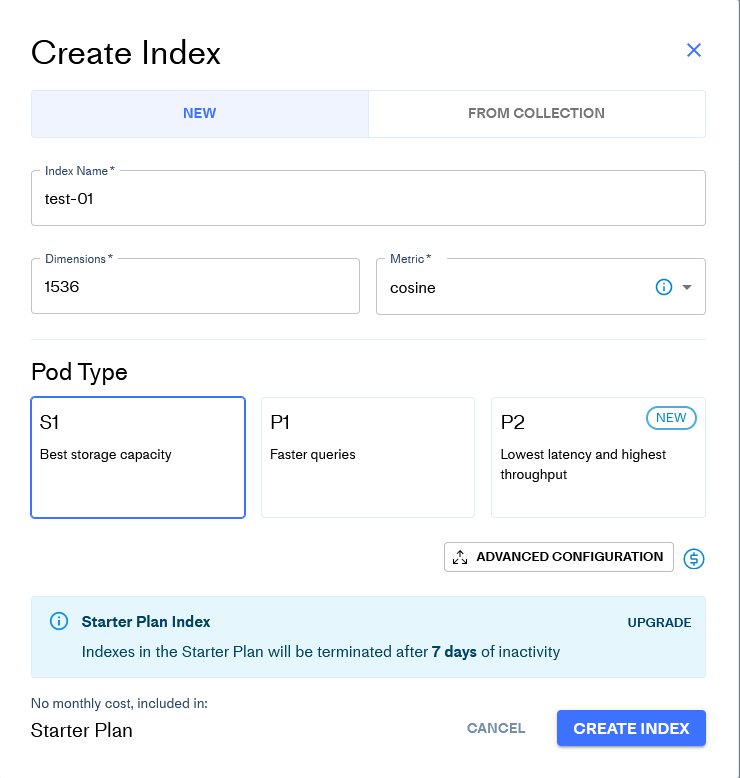
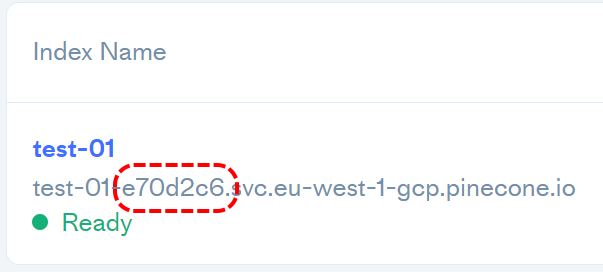

# Askit Local Demo

## Prerequisites

- [Docker Desktop](https://www.docker.com/)
- [Git](https://git-scm.com/)
- A terminal with access to docker (Not CMD on Windows)

## Setup

1. Clone this repository with this command `git clone --recurse-submodules https://github.com/lnu-askit/full-local-demo.git`
2. Copy example.env to .env and fill in the values
3. Run `docker compose up`
4. Open [http://localhost:3000](http://localhost:3000) in your browser

### Environment variables in .env

```env
DATASTORE=
PINECONE_ENVIRONMENT=
PINECONE_INDEX=
PINECONE_API_KEY=
BEARER_TOKEN=
OPENAI_API_KEY=
SCRAPER_KEY=
NEXT_PUBLIC_GPT_MODEL=
```

Let's begin with pinecone which is our vector database.

Go to https://www.pinecone.io/ and create an account. Create a new index and name it whatever you'd like but Dimensions has to be 1536.

It should look something like this:
<br />


In the Indexes overview it should then look like this:
<br />


The Project ID is unlabeled in the interface, so it is circled here for clarity:
<br />


Update the .env file with the values from pinecone.

Go to API Keys and copy the default key and paste in in the .env file where it says PINECONE_API_KEY.

Next up is the OPENAI_API_KEY. Go to https://beta.openai.com/ and create an account then create an API key copy it and paste it in the .env file.

Your .env should look something like this:

```env
DATASTORE=pinecone
PINECONE_ENVIRONMENT=eu-west1-gcp
PINECONE_INDEX=test-01
PINECONE_API_KEY=your pinecone api key
PINECONE_PROJECT_ID=e70d2c6
OPENAI_API_KEY=your openai api key
NEXT_PUBLIC_GPT_MODEL=gpt-3.5-turbo
BEARER_TOKEN=this can be whatever you like such as: nsitrnapd83msls82sladksia8
SCRAPER_KEY=this can be whatever you like such as: nsitrnapd83msls82sladksia8
```

## Tear down

1. Run `docker compose down --rmi all --volumes`
